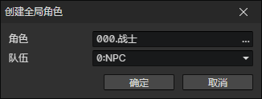

# 创建全局角色

创建指定角色文件对应的全局角色，一个文件只能创建一个全局角色。  
一旦创建后该全局角色的数据将被记录到游戏存档中。  
之后可以通过角色文件来访问已创建的全局角色。

- 角色：角色访问器
- 队伍：角色所在的队伍

:::tip

可以利用全局角色的数据会被保存这个特性，来设计一些功能，比如：  
通过<设置库存>指令让商店老板共享使用一名全局角色的库存。每隔一段时间刷一些随机装备到这个库存中，就能实现随机商店库存系统。  
或者让一个全局角色的库存，充当玩家的仓库，利用这一点来制作仓库系统。

提示：玩家初始队伍中角色，会在游戏初始化时自动创建为全局角色。（在项目设置中查看）

:::