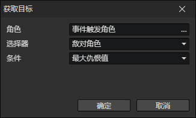

# 获取目标

从指定角色的目标角色池中抽取一名符合条件的角色，并把他写入到角色访问器的<目标角色>。

- 角色：角色访问器
- 选择器：限制目标角色跟自己的关系（初步筛选）
  - 敌对角色
  - 友好角色
  - 队伍成员
  - 除自己外的队伍成员
  - 除自己外的任意角色
  - 任意角色
- 条件
  - 最大仇恨值：给本角色造成最大威胁的角色
  - 最近距离：离本角色最近距离的角色
  - 最远距离：离本角色最远距离的角色
  - 最小属性值：指定的属性值最小的角色，启用参数(属性)
  - 最大属性值：指定的属性值最大的角色，启用参数(属性)
  - 最小属性比率：两个属性值比率最小的角色，启用参数(属性，属性2)
  - 最大属性比率：两个属性值比率最大的角色，启用参数(属性，属性2)
  - 随机：随机选择一个角色