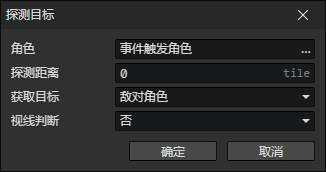

# 探测目标

通过搜索获取附近符合条件的目标角色，并添加到目标角色池中。

- 角色：角色访问器
- 探测距离：获取一个圆形范围内的角色，添加到目标池
- 获取目标：限制目标角色跟自己的关系
  - 敌对角色
  - 友好角色
  - 队伍成员
  - 除自己外的队伍成员
  - 除自己外的任意角色
  - 任意角色
- 视线判断：启用时，如果本角色与目标角色之间存在墙块地形，遮挡了视线，将放弃该目标。