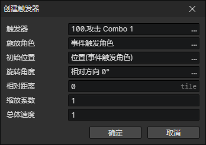

# 创建触发器

在技能施放事件中，经常需要创建一个触发器去实现技能伤害。  
当触发器与目标角色相撞时，就会调用击中角色事件。  
使用极坐标系来确定位置：从初始位置这里，旋转一定角度，向前偏移一段距离，作为触发器的创建位置。  
可以把总体速度设置为角色的攻击速度。

触发器中还可以嵌套触发器：  
在触发器自动执行事件中，每隔一段时间再创建一个触发器，就可实现暗黑破坏神2冰封球的技能效果。

- 触发器：触发器文件
- 施放角色：在触发器事件中可以通过<技能施放角色>获取这个角色
- 初始位置：初始参考位置
- 旋转角度：触发器的初始角度
- 相对距离：触发器在初始位置和初始角度的基础上向前偏移的距离（实际位置）
- 缩放系数：整体缩放触发器的形状和动画（可以当作攻击范围）
- 总体速度：整体改变触发器的速度（可以当作攻击速度）