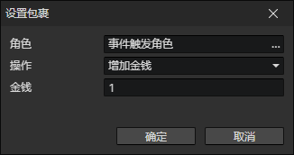

# 设置库存

- 角色：角色访问器
- 操作
  - 增加金钱
  - 减少金钱
  - 增加物品：增加指定ID的物品
  - 减少物品：减少指定ID的物品
  - 获得装备：创建指定ID的装备，添加到角色库存中
  - 失去装备：移除指定ID的装备
  - 获得装备实例：读取装备访问器，添加到库存中
  - 失去装备实例：读取装备访问器，从库存中移除它
  - 交换物品位置：交换库存中两个物品的位置
  - 简单排序：消除物品之间的空格子，但是不改变物品顺序
  - 按文件名排序：消除物品之间的空格子，同时改变物品顺序
  - 使用全局角色的库存：使用指定全局角色的库存作为本角色的库存（共享）
  - 恢复库存：恢复自己的独立库存
  - 重置：清空库存中的物品和金钱