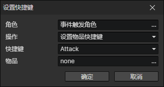

# 设置快捷键

可以添加物品或技能到快捷栏，也可删除指定的快捷栏位。

- 角色：角色访问器
- 操作
  - 设置物品快捷键：将指定ID的物品设置到快捷栏
  - 设置技能快捷键：将指定ID的技能设置到快捷栏
  - 删除快捷键：从快捷栏中删除快捷键对应的物品或技能
  - 交换快捷键：交换快捷栏中两个快捷键对应的物品或技能

:::tip

快捷键可在枚举窗口[F7]中自定义。

:::