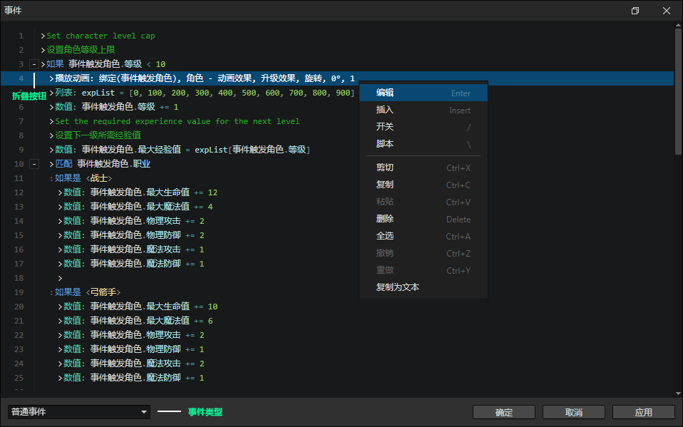
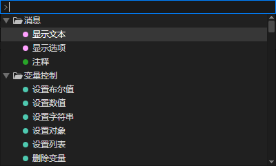

# 事件窗口

- 事件类型
  - 普通事件：不会自动触发的事件
  - 特殊事件：游戏中的特定行为自动触发的事件，如鼠标按下、键盘按下、自动执行等
  - 自定义事件：通过枚举窗口设置的自定义事件，需要通过<调用事件>指令手动调用
- 快捷键
  - Up：选择上一个指令
  - Down：选择下一个指令
  - PageUp：向上翻页并选择指令
  - PageDown：向下翻页并选择指令
  - Ctrl + PageUp：向上翻页
  - Ctrl + PageDown：向下翻页
  - Home：滚动到顶部并选择指令
  - End：滚动到底部并选择指令
  - Ctrl + Home：滚动到顶部
  - Ctrl + End：滚动到底部

### 上下文菜单

- 编辑：编辑选中的指令
- 插入：在选中的指令前面插入一个新的指令
- 开关：启用/禁用选中的指令，如果被禁用，运行游戏时将不会生效
- 脚本：插入Javascript脚本到当前位置，可用于调试。例如查看本地变量的脚本：console.log(Event.attributes)，在游戏中按F12打开控制台查看输出信息
- 复制为文本：将选中的指令输出为文本格式，方便发到论坛上进行交流学习

### 指令输入框

在指令列表中，按下A-Z，空格键，Insert，可搜索事件指令，再按回车可插入选中的指令。  
当鼠标悬浮在输入框下方的指令列表中时，会提示搜索关键字，可以通过关键字或名称搜索事件指令。

- 快捷键
  - Up：选择上一个指令
  - Down：选择下一个指令
  - PageUp：向上翻页并选择指令
  - PageDown：向下翻页并选择指令
  - Escape：关闭指令输入框